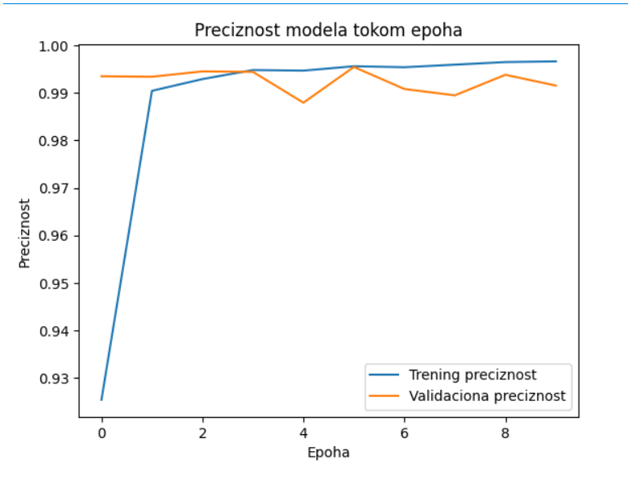
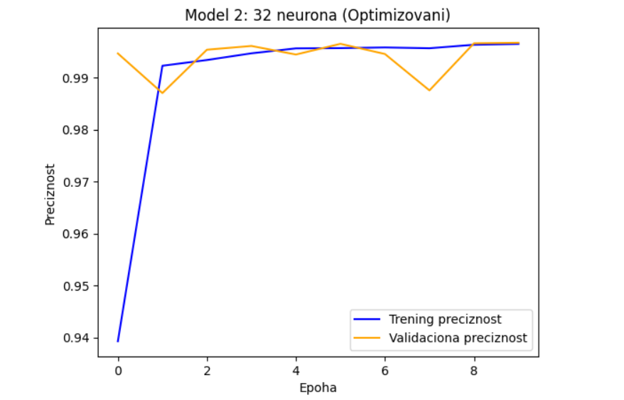

# Klasifikacija support ticketa pomoću neuronskih mreža
Ovaj projekat je razvijen u okviru predmeta Duboko učenje i neuronske mreže. Fokus rada je na automatizaciji procesa klasifikacije korisničkih zahteva (tiketa) primenom dubokih neuronskih mreža.

## 1. Opis problema
U savremenom digitalnom ekosistemu, efikasna tehnička podrška je ključni stub održavanja kontinuiteta poslovanja. Sa porastom broja korisnika i složenosti IT usluga, količina generisanih zahteva (tiketa) raste eksponencijalno. Tradicionalni pristupi, koji podrazumevaju manuelnu trijažu i ručno preusmeravanje svakog upita, postali su neefikasni, spori i podložni ljudskim greškama. Zbog toga se javlja imperativna potreba za razvojem automatizovanih sistema zasnovanih na veštačkoj inteligenciji koji mogu trenutno i precizno da klasifikuju zahteve korisnika.

Proces automatske klasifikacije odvija se na sledeći način: Kada korisnik pošalje upit, njegov tekstualni opis (body) se trenutno prosleđuje našem modulu za verifikaciju. Ovaj modul, pokretan algoritmom veštačkih neuronskih mreža, analizira semantiku i kontekst poruke kako bi je klasifikovao u jednu od dve kritične kategorije: Incident (nepredviđeni kvar ili prekid usluge) ili Zahtev (formalni upit za pristup ili informaciju). Na osnovu ove odluke, sistem automatski rutira tiket odgovarajućem timu tehničke podrške, čime se drastično smanjuje vreme čekanja na odgovor (engl. Response Time).

Tehnički izazovi i prednosti neuronskih mreža: Glavni tehnički izazov u ovom domenu, jeste debalans klasa (engl. class imbalance). U našem skupu podataka, incidenti čine dominantnu većinu (~71%), dok su zahtevi ređi. Tradicionalni algoritmi često imaju tendenciju da favorizuju većinsku klasu, ignorišući suptilne razlike u manjinskim uzorcima. Međutim, duboke neuronske mreže, zahvaljujući primeni slojeva za učenje reprezentacija reči (engl. Embedding) i nelinearnih aktivacionih funkcija, poseduju jedinstvenu sposobnost da uoče skrivene lingvističke obrasce i anomalije u tekstu koje opisuju specifičan problem, čak i u uslovima nesrazmere podataka.

Predmet i cilj projekta: Predmet ovog projektnog zadatka je implementacija i evaluacija modela neuronskih mreža sa ciljem binarne klasifikacije tiketa. Fokus rada nije samo na postizanju visoke tačnosti, već i na:
- Naprednom preprocesiranju: Čišćenju i tokenizaciji nestrukturiranog teksta.
- Hiperparametarskoj optimizaciji: Istraživanju uticaja dubine mreže (promena broja neurona sa 16 na 32) na stabilnost i preciznost modela.
- Poslovnom balansu: Pronalaženju optimalne tačke između brzine klasifikacije i pouzdanosti, kako bi se osiguralo vrhunsko korisničko iskustvo bez neopravdanih zastoja u radu.

## 2. Podaci
Kod tradicionalnih algoritama za obradu teksta s kojima smo se ranije susretali, pretpostavka je često linearna ili zasnovana isključivo na prisustvu specifičnih ključnih reči. Na primer, mogli bismo pretpostaviti da ako se u tiketu pojavljuje reč „lozinka“, to je automatski rutinski zahtev (Request).

U realnosti, potrebe korisnika su mnogo suptilnije. Rečenica „Ne mogu da promenim lozinku“ može biti rutinski zahtev, dok „Sistemska lozinka više ne prolazi na serveru“ može označavati kritičan bezbednosni incident. Dakle, anomalija i razlika između klasa nije u pojedinačnim rečima, već u specifičnim semantičkim kombinacijama i kontekstu pod kojim su te reči upotrebljene.

Glavni cilj ovog rada jeste komparativna analiza performansi različitih konfiguracija veštačkih neuronskih mreža (sa 16 i 32 neurona) nad tekstualnim podacima, a sve u svrhu identifikacije optimalnog modela za primenu u realnom sistemu IT podrške.

Automatizacija podrške zahteva balansiranje između dva dijametralno suprotstavljena cilja:
- Maksimizacija preciznosti rutiranja: Osigurati da se incidenti (klasa 1) trenutno prepoznaju.
- Očuvanje efikasnosti: Izbegavanje lažnih uzbuna gde se obični administrativni zahtevi klasifikuju kao hitni kvarovi, čime se bespotrebno opterećuju inženjerski timovi.

Kroz razvoj modela, analiziraćemo kako povećanje kompleksnosti mreže utiče na ovaj kompromis:
- Model 1: Osnovni model sa 16 neurona u skrivenom sloju (Baseline).
- Model 2: Optimizovani model sa 32 neurona (Analiza osetljivosti).

Skup podataka korišćen u radu preuzet je sa platforme Kaggle (all_tickets.csv). Dataset sadrži ukupno 48.549 instanci realnih zahteva korisnika. Kao što je navedeno u opisu problema, ovaj skup je debalansiran: incidenti (Klasa 1) čine 71% podataka (34.621 unosa), dok zahtevi (Klasa 0) čine 29% (13.928 unosa).

U pogledu atributa, fokus je na nestrukturiranom tekstu kolone body. Kako bi neuronska mreža mogla da interpretira ovaj tekst, primenili smo proces vektorizacije kroz Embedding sloj. Ovaj korak funkcioniše kao napredna tehnika smanjenja dimenzionalnosti: umesto da radimo sa ogromnim rečnikom od 10.000 reči, mreža automatski 'sabija' te informacije u guste vektore manjih dimenzija (16). Na taj način se zadržava suština i semantički kontekst zahteva, dok se istovremeno uklanja informacioni šum, što modelu omogućava da uoči skrivene lingvističke obrasce koji razlikuju incidente od običnih zahteva.

## 3. Arhitektura modela
Model je definisan kao sekvencijalna neuronska mreža sa sledećim slojevima:
- Embedding sloj: Vektorizacija teksta koja omogućava mreži da uči suptilne semantičke odnose između reči (input_dim=10000, output_dim=16).
- GlobalAveragePooling1D: Smanjenje dimenzionalnosti i izvlačenje ključnih karakteristika.
- Dense (skriveni) sloj: 16 neurona sa ReLU aktivacionom funkcijom.
- Dense (izlazni) sloj: 1 neuron sa Sigmoid aktivacijom za binarnu klasifikaciju. Ukupan broj parametara modela je 160.289.

## 4. Trening
U okviru ovog projekta obučena su dva modela kako bi se utvrdio uticaj širine skrivenog sloja na performanse klasifikacije. Oba modela su trenirana uz sledeće zajedničke parametre: 10 epoha, batch size 32, Adam optimizator i binary_crossentropy funkcija gubitka. Za validaciju je korišćeno 20% podataka iz trening seta.
- Model 1 (Baseline): Osnovni model sa 16 neurona u skrivenom sloju. Ovaj model služi kao polazna tačka za evaluaciju performansi na nestrukturiranom tekstu.
- Model 2 (Optimizovani): Model sa 32 neurona u skrivenom sloju, kreiran radi provere da li veći broj neurona omogućava bolje prepoznavanje složenih lingvističkih obrazaca.

## 5. Analiza osetljivosti i hiperparametrska optimizacija
Analiza osetljivosti je sprovedena kroz promenu broja neurona u skrivenom sloju, što predstavlja ključni korak u hiperparametarskoj optimizaciji. Fokus je stavljen na poređenje stabilnosti učenja između Baseline modela (16 neurona) i optimizovanog modela (32 neurona).
Primećeno je da model sa 32 neurona brže konvergira i pokazuje veću stabilnost validacione preciznosti na samom početku treninga. Ova konfiguracija omogućava mreži da efikasnije modeluje debalansirane klase, što je kritično s obzirom na to da incidenti čine 71% našeg skupa podataka.

## 6. Rezultati evaluacije
Uspešnost implementiranih modela u klasifikaciji IT tiketa evaluirana je kroz praćenje krive preciznosti (accuracy) tokom 10 epoha treninga. Postignuti rezultati ukazuju na izuzetno visoku sposobnost obe konfiguracije da prepoznaju obrasce u tekstu, uprkos izraženom debalansu klasa.

| **Metrika / Model** | **Model 1 (16 neurona)** | **Model 2 (32 neurona)** |
| :--- | :--- | :--- |
| **Početna preciznost (E0)** | ~92.5% | **~94.0%** |
| **Finalna trening preciznost** | ~99.67% | **~99.7%** |
| **Stabilnost validacije** | Oscilacije (E4, E7) | **Visoka (stabilniji trend)** |
| **Konačna ocena** | Zadovoljavajuća | **Optimalna** |

  
   
  <em>Slika 1: Preciznost Baseline modela sa 16 neurona tokom 10 epoha</em>

Model 1 (Baseline): Na grafiku se uočava brz inicijalni skok preciznosti. Međutim, narandžasta kriva (validacija) pokazuje primetnu nestabilnost sa oštrim padovima u 4. i 7. epohi, što ukazuje na to da je jednostavnija arhitektura osetljivija na specifične varijacije u testnim podacima.

  
   
  <em>Slika 2: Preciznost optimizovanog modela sa 32 neurona tokom 10 epoha</em>

Model 2 (Optimizovani): Kao što je prikazano na grafiku, ovaj model startuje sa višom preciznošću i održava znatno stabilniji trend učenja. Iako je zabeležen pad u 7. epohi, kriva se brže oporavlja, a finalni rezultati na validacionom skupu su skoro izjednačeni sa trening preciznošću, što potvrđuje bolju sposobnost generalizacije.

## 7. Diskusija
Rezultati eksperimenta otkrivaju jasnu dinamiku uticaja širine skrivenog sloja na proces učenja. Analizom dobijenih rezultata možemo izvući sledeće ključne zaključke:
- Superiornost Modela 2: U našem projektu Model 2 (32 neurona) predstavlja optimalan izbor. Veći broj neurona omogućio je mreži da efikasnije „sabije“ informacije iz Embedding sloja i uoči suptilne semantičke razlike koje odvajaju incidente od običnih zahteva, što rezultira stabilnijom validacionom krivom.
- Problem debalansa klasa: Uočene oscilacije u 7. epohi na oba grafika su direktna posledica činjenice da incidenti čine čak 71% podataka. Model povremeno „luta“ u potrazi za optimalnom granicom odlučivanja za manjinsku klasu (zahteve), što je tipičan izazov kod ekstremno debalansiranih baza podataka.
- Analiza robusnosti: Model 2 pokazuje bolju otpornost na šum u podacima. Dok Model 1 pokazuje znake blagog preprilagođavanja (overfittinga) usled nestabilne validacije, Model 2 gradi svoju odluku na robusnijim lingvističkim šablonima, što ga čini pouzdanijim za primenu u realnom sistemu IT podrške.
- Moguća unapređenja: Iako je preciznost od preko 99% vrhunski rezultat, diskusija o nestabilnosti u pojedinim epohama ukazuje na to da bi sledeći korak mogao biti uvođenje tehnika poput Dropout slojeva ili regularizacije, kako bi se dodatno „ispeglale“ krive učenja i osigurala maksimalna stabilnost modela.

## 8. Zaključak
U ovom radu implementirane su i evaluirane dve konfiguracije sekvencijalnih neuronskih mreža za automatizovanu klasifikaciju IT podrške, sa fokusom na rešavanje problema trijaže u uslovima realnog debalansa klasa.

Model 2 (sa 32 neurona u skrivenom sloju) pokazao se kao optimalno rešenje za ovaj zadatak. Za razliku od Baseline modela, ova konfiguracija je pokazala veću stabilnost tokom procesa učenja i bolju sposobnost generalizacije na validacionom skupu podataka. Vizuelna analiza kriva učenja potvrdila je da Model 2 brže konvergira i efikasnije obrađuje semantičke obrasce u tekstu, što je rezultiralo preciznošću od preko 99%.
Ključna lekcija ovog projekta, jeste da stabilno i postepeno učenje granica između klasa, bez preterano agresivnih arhitektonskih intervencija, daje superiorne rezultate. Iako debalans klasa (71% incidenata naspram 29% zahteva) predstavlja izazov, pokazano je da pravilno dimenzionisan skriveni sloj omogućava modelu da uoči suptilne lingvističke razlike koje su neophodne za tačnu klasifikaciju.
Postignuti rezultati čine ovaj model direktno primenljivim u realnom korporativnom okruženju. Automatizacijom prepoznavanja incidenata i zahteva sa pouzdanošću većom od 99%, drastično se smanjuje vreme odgovora (Response Time) i optimizuju resursi inženjerskih timova, čime je u potpunosti ispunjen primarni cilj projektnog zadatka.

## Podela rada
- Ana Marinković: Prikupljanje i preprocesiranje podataka, definisanje arhitekture modela (16 neurona), trening modela (16 neurona) i diskucija rezultata.
- Lana Spasić: Analiza podataka, tokenizacija i priprema za model, definisanje arhitekture modela (32 neurona) i trening modela (32 neurona) (analiza osetljivosti), generisanje grafika evaluacije i pisanje zaključka.

## Licenca
Ovaj projekat je licenciran pod MIT licencom.
